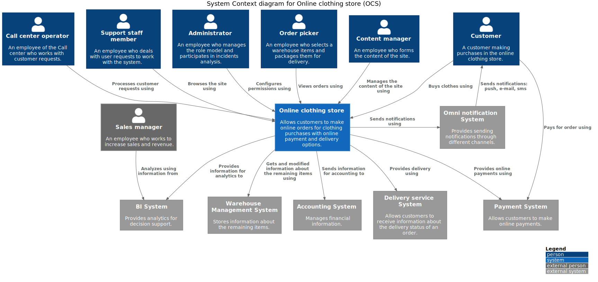

# Online Clothing Store (OCS) example

## System Context diagram

### Assumptions

1.	We do not have our own pick-up points, including an offline store, so we do not have sellers or cashiers who could also use our online store system to fulfil orders. Every order requires delivery.

## OCS main classes diagram

## Use Cases

### Assumptions
1.	An Order picker uses a tablet, so we don't need to print the order content. The website of the System must have a responsive web design for our customers and employees.
2.	An Order picker performs both picking and packing of orders as a single process.
3.	There is a single Order picker, so there is no need to distribute orders among employees and block an order for a specific employee to exclude the simultaneous work of several employees on one order.
4.	An Order picker does not print or attach a return form to a package to save money and reduce environmental impact.

### UC-01 «Picking & Packing of an Order»

#### Participants

Order picker, Online clothing store (System), WMS (Warehouse Management System), Omni notification System

#### Pre-conditions

A client has placed an order.

#### Result

An order is ready for delivery.

#### Main flow

|Step   |Participant    |Description    |
|-------|---------------|---------------|
|1.     |Order picker	|Requests a list of orders. |
|2.	    |System	        |Selects orders waiting picking or packing in ascending order |of creation date and displays a list of them with pagination.    |
|3.	    |Order picker	|Selects an order from the list.    |
|4.	    |System	        |Displays the order form without the ability to edit order |contents.   |
|5.	    |Order picker	|Finds the ordered items in the specified quantity in |the warehouse, picks them up and marks them on the form in the System    |.
|6.	    |System	        |Allows to complete the work with the order form when all the |items are marked.    |
|7.	    |Order picker	|Finishes working with the order form confirming by |this action the end of order picking.  |
|8.	    |System	        |Changes the order status to the one that characterizes the |end of order picking.  |
|9.	    |System	        |Offers to print a special order form which is attached to the |package for the delivery service.   |
|10.    |Order picker	|Prints out a special order form for the delivery |service. |
|11.    |Order picker	|Packs the items and sticks the printed order form to |the package. |
|12.    |Order picker	|Confirms the picking and packing of the order. |
|13.    |System	        |Changes the order status to the one that characterizes that |the order is ready for delivery.  |
|14.    |System	        |Changes the remaining items in the warehouse by interacting with WMS.  The use case ends.   |

#### Alternative flow 1

|Step   |Participant    |Description    |
|-------|---------------|---------------|
|6a.	|System	        |Allows to complete the work with the order form when NOT all the items are found generating a notification for the customer.|
|6a.1.  |Order picker	|Finishes working with the order form confirming by this action which items miss in the warehouse.|
|6a.2.  |System	        |Sends information to Omni notification System for generating and sending notification to the customer.|
|6a.3.  |System	        |Changes the order status to the one that characterizes the expectation of a decision by the customer to cancel the order or confirm the order without any items. The use case ends.|

## User stories (for UC-01 Main flow)

### US-01

As an Order picker, I want to view a list of orders awaiting picking and packing so that I can evaluate the load.

#### Acceptance criteria

1.	An Order picker can view a list of orders awaiting picking and packing.
2.	The list of orders is sorted in ascending order of creation date to support the FIFO principle.
3.	Overdue orders are highlighted.
4.	The list contains the following columns: …

### US-02

As an Order picker, I want to view the contents of a selected order to see which items I need to find in the warehouse.

#### Acceptance criteria

1.	An Order picker can view the contents of an order.
2.	The order form is not editable.

### US-03

As an Order picker, I want to mark order item in the order form when I’ve found and picked it up in the specified quantity to reduce the risk of a mistake.

#### Acceptance criteria
1.	An Order picker can mark order item in the order form.
2.	The option to close the order form with a confirmation that order picking has been completed is only available when all order items are marked.
3.	The status of the order has changed after closing and indicates the completed stage of the process.

### US-04

As an Order picker, I want the System to offer to print a special order form which is attached to the package for the delivery service in order to speed up my work and reduce the risk of a mistake.

#### Acceptance criteria
1.	The System offers to print a special order form which is attached to the package for the delivery service.
2.	An Order picker can print special order form which is attached to the package for the delivery service using the system’s offer.

### US-05

As an Order picker, I want to confirm the picking and packing of the order after I have packed the order so that I can mark my job as done.

#### Acceptance criteria

1.	An Order picker can confirm the picking and packing of the order.
2.	The status of the order has changed after confirmation and indicates the completed stage of the process.
3.	The remaining items have changed in the WMS according to the order.